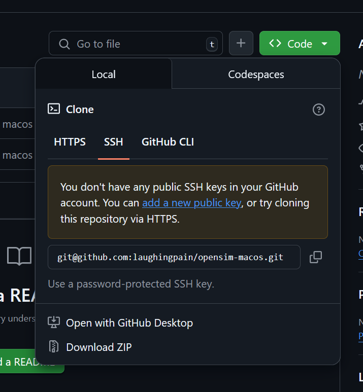
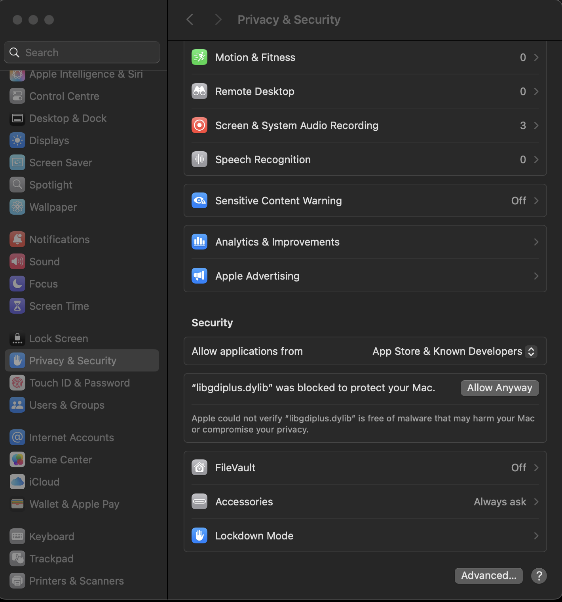

# Instructions

- download and install
[Dotnet8 SDK](https://dotnet.microsoft.com/en-us/download/dotnet/thank-you/sdk-8.0.408-macos-arm64-installer)

- click on the green "<> Code" - Button

- click "Download Zip"

- move the file to a location you want (you can also rename the file)

- unzip

- add all necessary config files (OpenSim.ini and in config-include folder)

- run opensim with dotnet OpenSim.dll

- if this window appears

click "Done", the same wondow appears

- open System Settings - > Privacy & Security

- scroll down and Click "Allow Anyway"

- now click in this window "Done"

Your OpenSim instance should be running

sorry for my bad english
